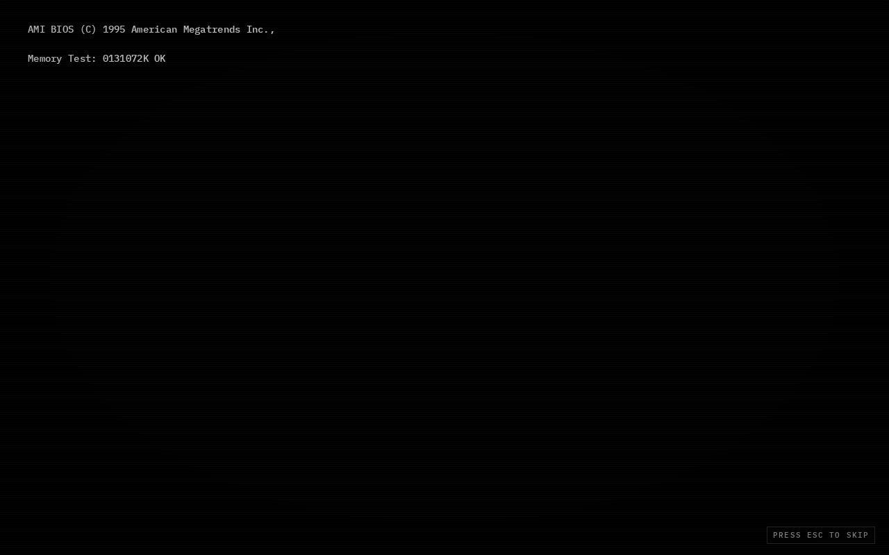

# isli-basha-portfolio

A Windows 95 desktop simulation built with React 19 + Vite. Double-click icons to open apps, drag windows around, and explore the retro OS experience.



## Apps

| Icon | App | Description |
|------|-----|-------------|
| `about.txt` | Notepad | About me |
| `projects` | File Explorer | Project showcase |
| `stack.cmd` | MS-DOS Prompt | Windows 95 terminal |
| `contact.exe` | Outlook Express | Retro email client |
| `readme.txt` | Notepad | README viewer |
| `paint.exe` | MS Paint | Drawing canvas |
| `iexplore.exe` | Internet Explorer | Pseudo web browser |
| `minesweeper.exe` | Minesweeper | Classic game |
| `snake.exe` | Snake | Classic game |

## Tech stack

- React 19 + Vite 6
- Tailwind CSS v4
- Vitest + Testing Library (172 tests)

## Run locally

```bash
npm install
npm run dev
```

## Branch

This is the `win95-demo` branch — a self-contained Win95 UI showcase.
